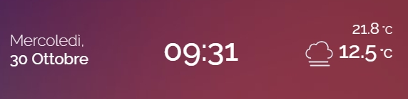
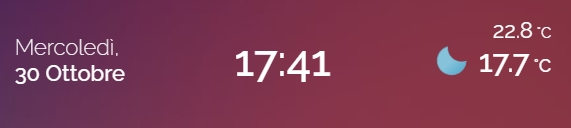

<h2><strong>🌤️ ha_date_hours_meteo card for home assistant</strong></h2>

Volevo condividere una scheda che ho creato con l'aiuto delle varie community per visualizzare data, ora e meteo interno ed esterno di casa.

Instructions:

da Hacs, installare:
1. button-card
2. layout-card

poi ...
1. nella cartella packeges incollare il file sensor_time_e_date.yaml
2. nella cartella www dovete andare ad incollare tutte le immagini del meteo come da percorso: www\ic\weather_icons\animated
3. in HA create una card manuale e incollate il contenuto del file: date_hours_meteo_card.yaml
4. Temperatura interna, modificare l'entità con la vostra alla riga 66 (io ho messo il sensore di temperatura del mio salone)
5. Temperatura esterna, modificare l'entità con la vostra alla riga 69 e 75 se avete un altro servizio di meteo (io ho usato weather.forecast)
6. per gli allineamenti e dimensioni dovete eventualmente modificare i parametri alle righe CARD, NAME, LABEL per i 3 blocchi: data, ora e meteo

Enjoy!

----------------------------------------

Would you like to give me a hand? The content of this page is completely free of charge and the purpose is certainly not to make money. If you would like to lend me a hand to help with expenses and lost time, you have the following ways:

Make your Amazon purchases from this link:

Join our Telegram channel dedicated to Home Assistant news:

Join our Telegram channel dedicated to home automation products, there are lots of offers:

